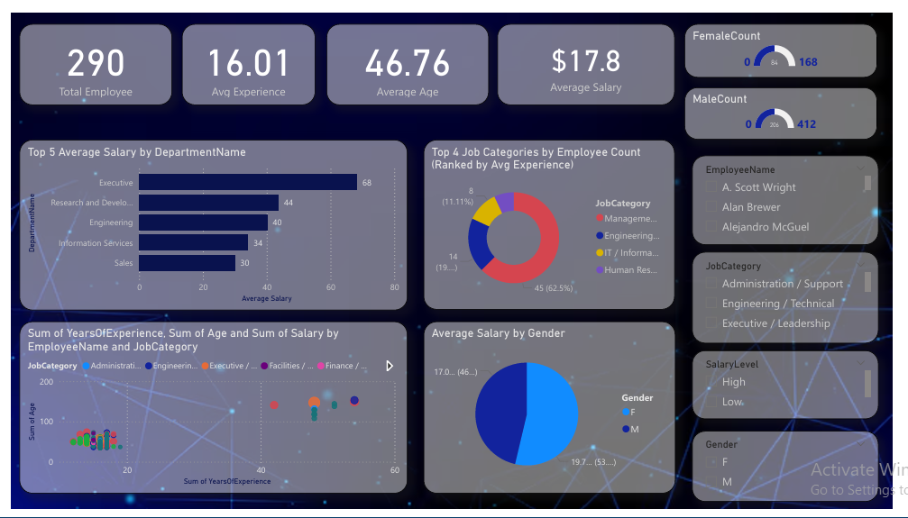
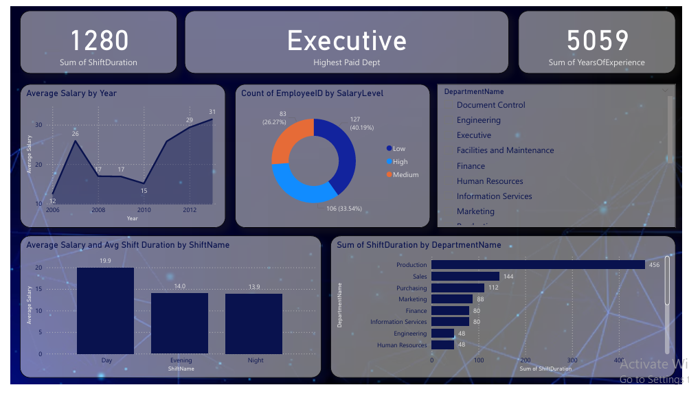

# 👩‍💼 HR Analytics Dashboard - Power BI

## 🎯 Objective
The goal of this project is to analyze employee performance, salary distribution, and shift patterns to help HR teams make data-driven decisions.  
The dashboard provides insights into workforce demographics, experience levels, departmental structure, and salary trends.

---

## ⚙️ Tools Used
- **Power BI** – for dashboard creation and visualization  
- **DAX Measures** – for advanced KPI calculations  
- **Power Query** – for data cleaning and transformation  
- **Excel / CSV** – for dataset preparation  

---

## 📊 Dashboard Overview

The **HR Analytics Dashboard** contains **two interactive pages**:

1. **Employee Overview** – Focuses on general employee demographics and experience distribution.  
2. **Shift & Salary Insights** – Highlights salary analysis, department comparisons, and shift duration insights.

Each page includes **KPIs, slicers, and visuals** that make HR analysis easy and insightful.

---

## 💡 Key Performance Indicators (KPIs)

### Page 1 — Employee Overview
- 👥 **Total Employees** — Total number of employees  
- 🧠 **Average Experience** — Average years of experience  
- 💵 **Total Salary Expense** — Total payroll cost  
- 🎂 **Average Age** — Average age of employees  

### Page 2 — Shift & Salary Insights
- ⏱️ **Average Shift Duration** — Average working shift length  
- 🏢 **Highest Paid Department** — Department with the highest average salary  

---

## 📈 Visualizations in the Dashboard

| Page | Visualization | Description |
|------|----------------|-------------|
| **Employee Overview** | 👩‍💼 Gender Distribution (Donut) | Shows the percentage of male and female employees |
|  | 🏢 Employees by Department (Bar) | Displays the number of employees in each department |
|  | 💼 Top 4 Job Categories by Avg. Experience (Donut) | Highlights the job categories with the highest experience levels |
|  | 📊 Experience vs. Age (Scatter) | Visualizes the relationship between age and experience |
| **Shift & Salary Insights** | 💰 Average Salary by Shift (Column) | Compares average salaries across different shifts |
|  | 🕒 Shift Duration per Department (Bar) | Shows average shift durations by department |
|  | 💵 Salary Level Distribution (Donut) | Displays how employees are distributed across salary levels |
|  | 📉 Salary Trend by Hire Year (Line) | Tracks average salary changes over time |
|  | 🏅 Top 5 Highest Paid Employees (Table) | Lists the top 5 employees with the highest salaries |

---

## 🎛️ Slicers
- Department Slicer → allows users to filter visuals and KPIs by specific departments for focused insights.

---
## 🖼️ Dashboard Preview

---

